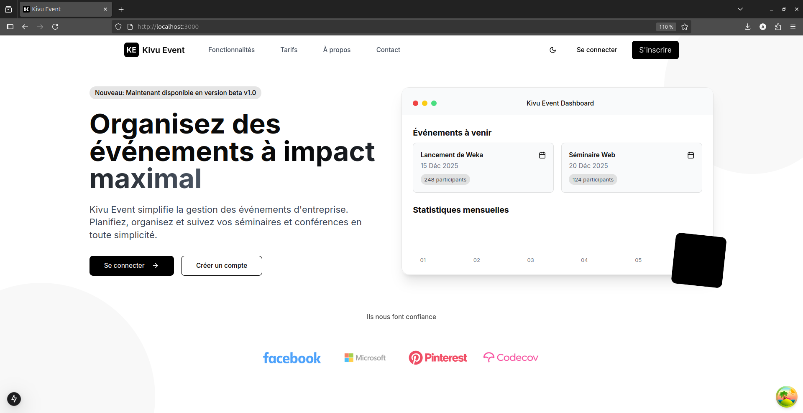

  

<h1 align="center">Kivu Event V0.1</h1>

  

  🔗 Application de Gestion des Événements d’Entreprise (Organisation des séminaires, conférences, et suivi des participants)

<strong>✨ Built by Anelka</strong>

---
